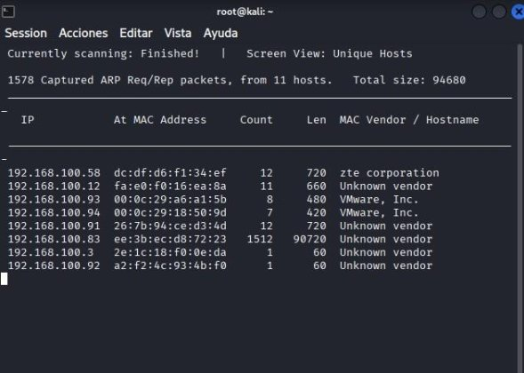
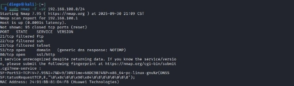
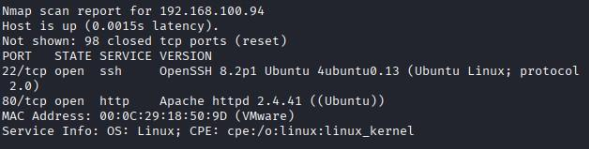
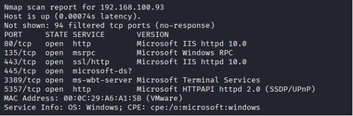

# Auditoría de Superficie de Ataque y Línea Base de Seguridad en Sistemas Operativos de Servidor

**Autor:** Diego Hernández Vázquez  
**Rol:** Estudiante de Ingeniería en Sistemas / Especialista en Ciberseguridad
**Tecnologías:** Ubuntu Server, Windows Server, Kali Linux, Nmap, Netdiscover, Modelado de Amenazas.

---

## Resumen Ejecutivo
Para establecer un plan de endurecimiento (*Hardening*) eficaz, es indispensable ejecutar primero un análisis de línea base que determine la superficie de exposición y los vectores de ataque activos en la infraestructura. 

Este proyecto documenta la Fase de Reconocimiento y Auditoría Ofensiva sobre dos plataformas de servidor corporativas: **Ubuntu Server** (alojando un servicio CMS WordPress sobre Apache y MySQL) y **Windows Server** (alojando una plataforma ERP Odoo sobre IIS y SQL Server). Utilizando técnicas de escaneo activo desde una distribución ofensiva (Kali Linux), se identificaron, clasificaron y modelaron las vulnerabilidades por servicios, categorizando sus niveles de riesgo para estructurar la posterior fase de mitigación técnica.

---

## Alcance de la Auditoría
* **Aprovisionamiento y Despliegue de Servicios:** Simulación de un entorno de producción con servicios críticos activos y accesibles (SSH, HTTP/HTTPS, SMB, RDP, RPC, Motores de Base de Datos).
* **Reconocimiento Pasivo y Activo de Red:** Identificación de hosts activos y mapeo de direccionamiento IP mediante herramientas de Capa 2 y Capa 3.
* **Escaneo de Superficie y Fingerprinting:** Descubrimiento de puertos abiertos, detección de versiones de software (*banners*) e identificación de sistemas operativos.
* **Modelado de Amenazas:** Clasificación detallada de los vectores de riesgo encontrados, analizando el impacto potencial de su explotación (RCE, MitM, Movimiento Lateral).

---

## Metodología de Reconocimiento y Descubrimiento

### 1. Descubrimiento de Activos (Capa 2)
Se implementó un segmento de red privado aislado para simular una zona de servidores desprotegida. Utilizando la herramienta `netdiscover`, se barrió el segmento para mapear de forma precisa las direcciones IP asignadas a los objetivos antes de iniciar los escaneos dirigidos.

*Figura 1: Mapeo de direccionamiento e identificación de hosts activos en el segmento.*

### 2. Escaneo Perimetral Activo (Capa 3 y 4)
Una vez localizados los servidores en la red, se ejecutaron escaneos de puertos utilizando `Nmap` para identificar los servicios expuestos hacia interfaces externas.

*Figura 2: Escaneo inicial de reconocimiento sobre los puertos más relevantes de la red.*

---

## Catálogo de Vulnerabilidades e Identificación de Riesgos

### Vector A: Servidor Ubuntu Server (Linux)
El análisis de *fingerprinting* reveló la exposición de servicios de administración y aplicaciones web sin controles de acceso restrictivos:

* **Servicio:** OpenSSH 8.2p1 (Puerto 22/TCP)
  * **Nivel de Riesgo:** **ALTO**
  * **Análisis de Impacto:** La exposición pública del banner de SSH permite a atacantes automatizados identificar la versión exacta del servicio. Si carece de políticas de empaquetado de llaves criptográficas o protección contra fuerza bruta, representa un vector crítico para accesos remotos no autorizados y posterior movimiento lateral.
* **Servicio:** Apache HTTPD 2.4.41 (Puerto 80/TCP)
  * **Nivel de Riesgo:** **MEDIO - ALTO**
  * **Análisis de Impacto:** El servidor web opera sobre el protocolo HTTP en texto plano (sin cifrado TLS/SSL). Las credenciales de administración del CMS (WordPress) e interacciones de usuarios viajan expuestas, siendo vulnerables a ataques de intercepción de tráfico (*Man-in-the-Middle*). Adicionalmente, la divulgación de la versión exacta de Apache facilita la búsqueda de *exploits* para Denegación de Servicio (DoS) o listado no autorizado de directorios.

*Figura 3: Diagnóstico de puertos y servicios expuestos en el nodo Linux.*

---

### Vector B: Servidor Windows Server
La auditoría sobre la infraestructura Microsoft evidenció una superficie de ataque sumamente amplia, caracterizada por la activación de servicios de compartición, administración remota y protocolos legacy:

* **Servicio:** Microsoft RPC (Puerto 135/TCP)
  * **Nivel de Riesgo:** **ALTO**
  * **Análisis de Impacto:** El servicio de Llamada a Procedimiento Remoto expone interfaces del sistema operativo y permite el descubrimiento de componentes DCOM. Es un vector históricamente explotado para la enumeración de rutas internas, facilitando el reconocimiento detallado del sistema para escalada de privilegios.
* **Servicio:** Microsoft IIS httpd 10.0 (Puertos 80/TCP y 443/TCP)
  * **Nivel de Riesgo:** **MEDIO - ALTO**
  * **Análisis de Impacto:** Al igual que el vector Linux, la persistencia de conexiones HTTP expone la lógica de negocio (Odoo ERP) a la captura de sesiones. En el puerto 443, la presencia de certificados autofirmados o configuraciones de cifrado (*ciphers*) obsoletas debilita la integridad de la capa criptográfica.
* **Servicio:** SMB - Server Message Block (Puerto 445/TCP)
  * **Nivel de Riesgo:** **ALTO - CRÍTICO**
  * **Análisis de Impacto:** La exposición del puerto 445 es uno de los riesgos más severos en infraestructura Windows. Permite el mapeo de recursos compartidos de red y la enumeración de usuarios. Sin un filtrado estricto, representa la puerta de entrada principal para el despliegue de *ransomware* corporativo y ejecución remota de comandos (*Remote Code Execution*).
* **Servicio:** Remote Desktop Protocol - RDP (Puerto 3389/TCP)
  * **Nivel de Riesgo:** **ALTO**
  * **Análisis de Impacto:** Permite el acceso interactivo al entorno gráfico del servidor. Si no se encuentra forzada la Autenticación a Nivel de Red (NLA) o si adolece de políticas de bloqueo de cuentas, se convierte en el blanco predilecto para ataques dirigidos de fuerza bruta.
* **Servicio:** Web Services for Devices - WSD (Puerto 5357/TCP)
  * **Nivel de Riesgo:** **MEDIO**
  * **Análisis de Impacto:** Facilita el descubrimiento automático de dispositivos en la red local, provocando fugas de información (*Information Disclosure*) al revelar nombres de hosts y esquemas de red que asisten al atacante en el mapeo de la organización.

*Figura 4: Fingerprinting completo de la superficie de exposición en Windows Server.*

---

## Diagnóstico de Infraestructura y Conectividad (Troubleshooting)

Durante el aprovisionamiento del laboratorio, se aislaron y remediaron fallos críticos de conectividad en la capa física virtual antes de poder ejecutar la auditoría:

* **Incidente 1: Pérdida de Conectividad Inter-VLAN (Host Unreachable):**
  * **Diagnóstico:** Las trazas de red (*ping*) desde el nodo ofensivo (Kali) hacia el servidor Ubuntu fallaban de forma persistente. Al auditar los adaptadores en el hipervisor VMware, se descubrió una mala segmentación: la máquina atacante estaba confinada en un switch virtual exclusivo (`VMnet19`), rompiendo el enlace de datos.
  * **Mitigación:** Se homologó la configuración de las tarjetas virtuales de red, forzando que tanto la interfaz de Kali Linux como la de Ubuntu Server apuntaran al mismo segmento personalizado (`Custom: LAN`), restableciendo el canal de comunicación.
* **Incidente 2: Inversión Lógico-Física de Interfaces y Pérdida de DHCP:**
  * **Diagnóstico:** El nodo de servidores carecía de salida a Internet y la interfaz secundaria (`ens37`) no obtenía direccionamiento. La auditoría física reveló que las tarjetas estaban cruzadas en VMware: el Adaptador 1 (configurado con IP estática interna) estaba conectado erróneamente a la red NAT con salida exterior, mientras que el Adaptador 2 (configurado para DHCP/NAT) estaba conectado al segmento LAN aislado (donde no existía servidor DHCP).
  * **Mitigación:** Se procedió a remapear los adaptadores de red en el hipervisor para alinearlos con la lógica de enrutamiento del sistema operativo: el Adaptador 1 se redirigió al segmento privado (`Custom: LAN`) y el Adaptador 2 se vinculó a la interfaz de traducción de direcciones (`NAT`), recuperando la salida hacia internet para la descarga de dependencias y estabilizando la IP estática interna para la auditoría.

---

## Conclusión de la Fase de Auditoría
Esta fase demostró empíricamente que la configuración por defecto de los sistemas operativos de servidor presenta una superficie de exposición inaceptable para estándares corporativos. Dejar servicios críticos como SMB, RDP o SSH abiertos sin restricciones perimetrales o políticas de hardening equivale a comprometer la infraestructura desde el despliegue. El catálogo de vulnerabilidades obtenido proporciona el mapa de ruta técnico indispensable para aplicar las contramedidas y controles de endurecimiento en la siguiente fase del proyecto.