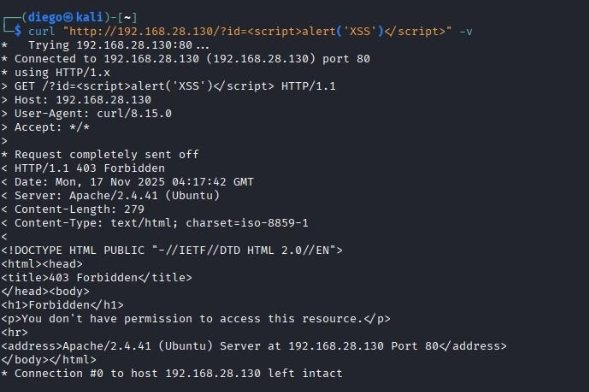
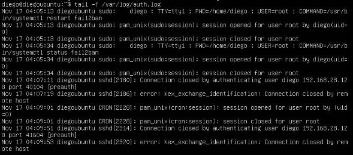

# Endurecimiento de Infraestructura y Mitigación de Vulnerabilidades (Server Hardening)

**Autor:** Diego Hernández Vázquez  
**Rol:** Estudiante en Ingeniería en Sistemas / Especialista en Ciberseguridad
**Tecnologías:** Ubuntu Server, Windows Server, UFW, Windows Defender Firewall, ModSecurity, WebKnight, Fail2Ban, IPBan, SSH (RSA).

---

## Resumen Ejecutivo y Caso de Negocio
Tras establecer la línea base de seguridad y mapear la superficie de ataque en la fase de auditoría, este proyecto documenta la ejecución táctica de la fase de remediación o *Hardening*. 

El objetivo es implementar el endurecimiento en los sistemas operativos de servidor (Ubuntu y Windows Server) para mitigar los vectores de amenaza identificados previamente. La estrategia se basó en el principio de Defensa en Profundidad (*Defense in Depth*), aplicando controles de acceso criptográficos, segmentación perimetral mediante firewalls locales, protección de Capa 7 con Web Application Firewalls (WAF) y mitigación de fuerza bruta con sistemas de detección de intrusos (IDS/IPS).

---

## Fase 1: Hardening en Entorno Linux (Ubuntu Server)

El aseguramiento del servidor Linux se centró en proteger las vías de administración remota, los servicios de compartición y la capa de aplicación web.

### 1. Control de Acceso Criptográfico (SSH)
Se abandonó la autenticación tradicional en favor de criptografía asimétrica. 
* Se generó un par de llaves RSA y se inyectó la llave pública en el servidor.
* Se modificó el archivo `/etc/ssh/sshd_config` para establecer `PasswordAuthentication no`, `KbdInteractiveAuthentication no` y `UsePAM no`.

### 2. Seguridad Perimetral y Compartición (UFW y Samba)
* Se implementaron políticas estrictas de filtrado utilizando `ufw`, denegando el tráfico por defecto y abriendo únicamente los puertos explícitamente requeridos.
* Se instaló y configuró el servicio Samba para la compartición segura de directorios, asignando permisos restrictivos y requiriendo un usuario autenticado específico (`sambapass`) en su archivo de configuración.

### 3. Protección de Capa 7 (ModSecurity WAF)
Para proteger el servidor Apache contra inyecciones y ataques web:
* Se instaló el módulo `security2` (ModSecurity).
* Se habilitó el conjunto de reglas estándar de la industria **OWASP Core Rule Set (CRS)**, configurando el motor para interceptar y bloquear anomalías HTTP.

### 4. Mitigación de Fuerza Bruta (Fail2Ban)
* Se desplegó `Fail2Ban` para monitorear los registros de autenticación.
* Se configuró un archivo local (`jail.local`) para habilitar la "prisión" (Jail) específica del servicio SSH.
---

## Fase 2: Hardening en Entorno Microsoft (Windows Server)

La mitigación en la infraestructura de Windows requirió el bloqueo activo de puertos *legacy* e implementación de escudos para el servidor web IIS.

### 1. Reducción de Superficie en Windows Defender Firewall
Se establecieron reglas de entrada explícitas para bloquear protocolos innecesarios que exponían la infraestructura a vulnerabilidades críticas:
* Bloqueo total del puerto 135 (MSRPC).
* Bloqueo total del puerto 5357 (WSD).
* Habilitación controlada de reglas de entrada exclusivas para el servicio Samba/SMB.

### 2. Protección Web con WebKnight (WAF para IIS)
* Se desplegó WebKnight como filtro ISAPI sobre el servidor IIS.
* Se configuró la utilidad para denegar métodos de petición no confiables y bloquear activamente firmas de *SQL Injection* (SQLi) y *Encoding Exploits* en cabeceras, cadenas de consulta (Querystrings) y peticiones POST.

### 3. IDS/IPS Nativo con IPBan
* Para mitigar ataques de fuerza bruta contra el protocolo RDP, se descargó e instaló IPBan mediante PowerShell, configurándolo como un servicio persistente del sistema.

---

## Auditoría de Validación y Troubleshooting (El Valor de la Ingeniería)

El verdadero valor del *hardening* reside en la validación empírica. Se ejecutaron pruebas ofensivas desde Kali Linux para comprobar la eficacia de los controles, lo que reveló comportamientos anómalos que exigieron diagnóstico avanzado (Troubleshooting).

### Validación de WAF (ModSecurity y WebKnight)
Ambos Web Application Firewalls demostraron una eficacia absoluta al enfrentar vectores de inyección de código:

| Plataforma | Métrica de Prueba | Estado Anterior (Auditoría) | Estado Actual (Post-Hardening) | Análisis Técnico |
| :--- | :--- | :--- | :--- | :--- |
| **Windows** | Ataque XSS (``) | HTTP 200 OK. Petición aceptada. | **HTTP 999 No Hacking**. | WebKnight identificó y bloqueó la solicitud maliciosa. Adicionalmente, ofuscó la cabecera `Server` (pasó de revelar IIS 10.0 a mostrar *WWW Server/1.1*). |
| **Ubuntu** | Ataque XSS en URI | HTTP 200 OK. | **HTTP 403 Forbidden**. | ModSecurity analizó la anomalía mediante las reglas OWASP y cortó la conexión en Capa 7. |

*Figura 3: Interceptación y bloqueo de payload XSS (HTTP 403 / HTTP 999) demostrando la eficacia de la protección en Capa 7.*

### Diagnóstico de Fallos Estructurales (Bugs y Falsos Positivos)

Durante las pruebas de mitigación de fuerza bruta, se detectaron fallos críticos en la configuración por defecto de las herramientas de seguridad, demostrando que la simple instalación de software no garantiza la protección:

**1. Anomalía en Autenticación SSH y Falla de Fail2Ban (Ubuntu):**
* **El Problema:** Tras desactivar la autenticación por contraseña en `sshd_config` y comprobarlo en el servidor (`sudo sshd -T`), el cliente remoto seguía recibiendo un *prompt* solicitando contraseña.
* **Impacto en el IDS:** Se simularon entre 3 y 5 intentos fallidos desde Kali, pero el puerto 22 seguía abierto; Fail2Ban no ejecutó el bloqueo de red.
* **Causa Raíz (Análisis de Logs):** Una auditoría profunda al archivo `/var/log/auth.log` reveló el *bug*. Debido a un fallo de estado o anulación PAM en la máquina virtual, los fallos de autenticación no emitían la cadena estándar *"Failed password"*. El sistema los registraba únicamente como *"Connection closed"*. Al no encontrar la firma esperada mediante *regex*, Fail2Ban resultó ciego e ineficaz.

*Figura 4: Análisis forense del registro `/var/log/auth.log` que permitió diagnosticar la ineficacia del IDS debido a la ausencia de la firma "Failed password".*

**2. Umbrales Permisivos en IPBan (Windows Server):**
* **El Problema:** Se ejecutó un ataque de fuerza bruta manual utilizando el cliente Remmina contra el puerto 3389 (RDP).
* **Causa Raíz:** A pesar de ejecutar 15 intentos fallidos deliberados, el puerto continuó abierto y la IP atacante no fue bloqueada.
* **Conclusión Técnica:** La instalación por defecto de IPBan posee umbrales de tolerancia demasiado altos. Para que sea efectivo en producción, exige un *hardening* secundario modificando directamente su archivo de configuración (`ipban.config`) para reducir la cantidad de intentos permitidos antes de accionar el firewall de Windows.

---

## 💡 Conclusión y Aprendizaje de Ingeniería

El desarrollo de esta práctica demuestra que el *hardening* de servidores requiere una configuración meticulosa y pruebas de auditoría exhaustivas para validar su eficacia. La transición hacia la autenticación por llaves asimétricas y la segmentación de red son cimientos innegociables para proteger infraestructuras corporativas.

Sin embargo, la lección técnica de mayor peso se materializó durante la validación de los IDS/IPS (Fail2Ban e IPBan): **"La seguridad no es un producto que se instala, es un proceso que se audita."** Se comprobó empíricamente que confiar en las configuraciones por defecto crea una falsa sensación de seguridad. Si los registros (*logs*) del sistema no se estandarizan o los umbrales de bloqueo no se ajustan a un modelo de amenazas estricto, las herramientas de seguridad se vuelven obsoletas frente a un atacante real. 

Por otro lado, el éxito irrefutable de los WAF (ModSecurity y WebKnight) reafirmó la importancia de la *Defensa en Profundidad*: cuando el firewall de red debe permitir tráfico legítimo (puerto 80), la inspección estricta en la Capa 7 es la única garantía para mantener la integridad de los datos.